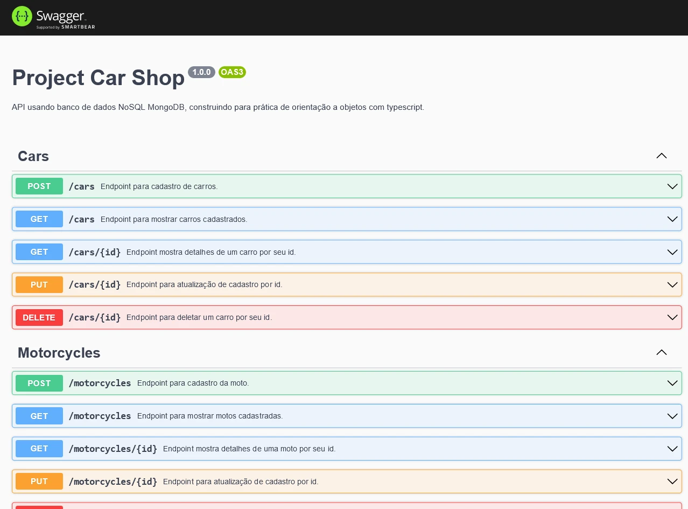
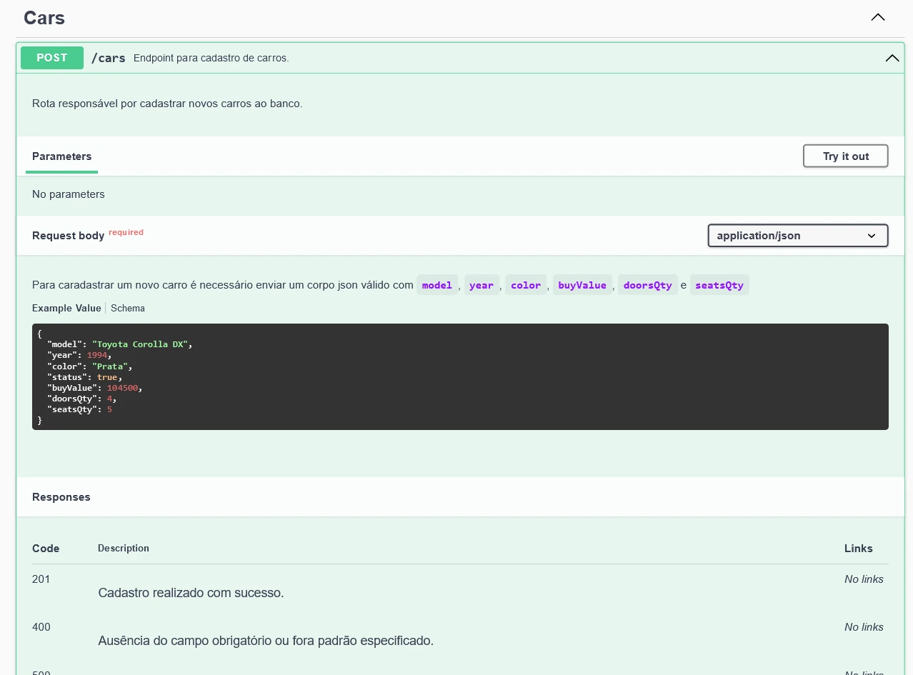
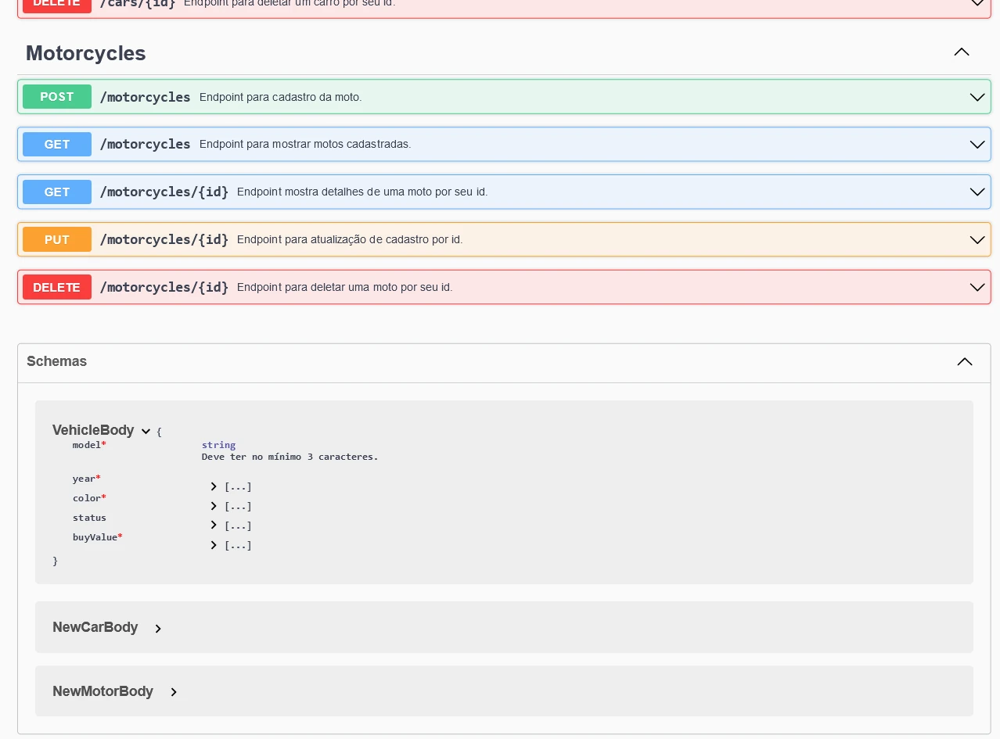

# Sobre

## Seção: `APIs OO e NoSQL`

- Ao contrário do MySQL que usamos um driver e depois usamos ORM, lidando com NoSQL ja foi abordado diretamente algo similar a ORM, no caso ODM que lida com dados estruturados em bandos NoSQL, apresentando o mongoose, configurações e o uso com orientação a objetos, validando dados usando o Zod.

#
<div align="center">
  <a href="https://raw.githubusercontent.com/davidrogger/trybe-project-trybesmith/readme-update/readme-imgs/project_top.webp">
    
  </a>
  <a href="https://raw.githubusercontent.com/davidrogger/trybe-project-trybesmith/readme-update/readme-imgs/project_mid.webp">
    
  </a>
  <a href="https://raw.githubusercontent.com/davidrogger/trybe-project-trybesmith/readme-update/readme-imgs/project_bot.webp">
    
  </a>
</div>

>*Imagens da documentação swagger*
#
## Projeto: `Car Shop`

- Uma API com banco NoSQL...

# Tecnologias e ferramentas usadas 🛠


# Desafios

- Aplicar conhecimentos de Orientação a Objetos;
- Utilização de Composição;
- Criação e utilização de Interfaces;
- Implementar classes, instâncias, atributos, métodos e objetos;
- Usar os conhecimentos de MongoBD, Typescript e POO na criação do CRUD da API.

# Conclusão

- lore

</details>

<details>
  <summary>
    <strong>
      :newspaper_roll: Requisitos solicitados durante o desenvolvimento do projeto
    </strong>
  </summary>

 
  ### Requisitos
  *Nome* | *Avaliação*
  --- | :---:
  01 - Crie a interface genérica IModel | :heavy_check_mark:
  02 - Crie a interface IVehicle | :heavy_check_mark:
  03 - Crie a interface ICar a partir da interface IVehicle | :heavy_check_mark:
  04 - Crie uma rota para o endpoint /cars onde seja possível cadastrar um novo carro | :heavy_multiplication_x:
  05 - Escreva testes para cobrir 15% da camada de Model | :heavy_multiplication_x:
  06 - Escreva testes para cobrir 15% da camada de Service | :heavy_multiplication_x:
  07 - Escreva testes para cobrir 15% da camada de Controller | :heavy_multiplication_x:
  08 - Crie uma rota para o endpoint /cars onde seja possível listar todos os carros registrados | :heavy_multiplication_x:
  09 - Crie uma rota para o endpoint /cars/id onde seja possível listar um único carro através do seu id | :heavy_multiplication_x:
  10 - Escreva testes para cobrir 30% da camada de Model | :heavy_multiplication_x:
  11 - Escreva testes para cobrir 30% da camada de Service | :heavy_multiplication_x:
  12 - Escreva testes para cobrir 30% da camada de Controller | :heavy_multiplication_x:
  13 - Crie uma rota para o endpoint /cars/id, onde é possível atualizar o registro de um carro através do seu id | :heavy_multiplication_x:
  14 - Escreva testes para cobrir 60% da camada de Model | :heavy_multiplication_x:
  15 - Escreva testes para cobrir 60% da camada de Service | :heavy_multiplication_x:
  16 - Escreva testes para cobrir 60% da camada de Controller | :heavy_multiplication_x:
  17 - Crie uma rota para o endpoint /cars/id para excluir os registros de um carro | :heavy_multiplication_x:
  18 - Crie a interface IMotorcycle a partir da interface IVehicle | :heavy_multiplication_x:
  19 - Crie uma rota para o endpoint /motorcycles onde seja possível cadastrar uma nova moto | :heavy_multiplication_x:
  20 - Crie uma rota para o endpoint /motorcycles onde seja possível listar todas as motos registradas | :heavy_multiplication_x:
  21 - Crie uma rota para o endpoint /motorcycles/id onde seja possível listar uma única moto através do seu id | :heavy_multiplication_x:
  22 - Crie uma rota para o endpoint /motorcycles/id onde é possível atualizar o registro de uma moto através do seu id | :heavy_multiplication_x:
  23 - Crie uma rota para o endpoint /motorcycles/id para excluir os registros de uma moto | :heavy_multiplication_x:


</details>

<details>
  <summary>
    <strong>
      :memo: Todo list
    </strong>
  </summary>

  - [x] - ~~Criar aplicação com base nos requisitos da trybe.~~ 

</details>

<details>
  <summary>
    <strong>
      :computer: Instruções do  Projeto
    </strong>
  </summary>

> ### Importante seguir a ordem apresentada a baixo, para o funcionamento.

<details>
<summary>
  <strong>
    ⚠️ Configurações mínimas para execução do projeto
  </strong>
</summary>

  > - Sistema Operacional Distribuição Unix
  > - Node versão >= 16
  > - Docker
  > - Docker-compose versão >=1.29.2
  > - API Client ([Thunder Client](https://www.thunderclient.com/), [Insomnia](https://insomnia.rest/), [POSTMAN](https://www.postman.com/), ou algum outro de sua preferência)

  </details>

  <details>
  <summary>
    <strong>
      ⚠️ Inicie o docker-compose
    </strong>
  </summary>

  >Após clonar o respositório para iniciar o docker compose, você deve dentro da pasta raiz do projeto usar o comando: `docker-compose up -d`
  >Verifique os containers, usando o comando `docker ps` no terminal. Deve aparecer dois containers com o nome de *trybesmith* e *trybesmith_db*.
  </details>

  <details>
    <summary>
      <strong>
        🗂 Acessando as Rotas
      </strong>
    </summary>

  >Para acessar e testar as rotas:
  >1. Usando algum API Cliente, conforme citado nas configurações mínimas.
  >2. Acessando a documentação gerada pelo swagger `localhost:3000/api-docs`.

  <details>
  <summary>
      <span>Endpoint <code>/cars</code></span>
  </summary>

  ## POST - `localhost:3000/cars`

  > - Rota responsável cadastrar novos carros.
  > - Para cadastrar o carro, é necessário realizar uma requisição POST para URL: `localhost:3001/cars` contendo um corpo json com:
  > - `model` Deve conter no mínimo 3 caracteres, com o modelo do carro.
  > - `year` Deve estrar em 1900 e 2022, com o ano do carro.
  > - `color` Deve ter no mínimo 3 caracteres, com a cor do carro.
  > - `status` Opcional, Deve ser um boolean, definindo se o cara está apto para venda.
  > - `buyValue` Deve ser um valor positivo, com o preço de venda do carro.
  > - `doorsQty` Deve ser um número entre 2 e 4, com a quantidade de portas do carro.
  > - `seatsQty` Deve ser um número entre 2 e 7, com a quantidade de assentos no carro.
    > ### Exemplo:
  >```
  >{
  >  "model": "Toyota Corolla DX",
  >  "year": 1994,
  >  "color": "Prata",
  >  "status": true,
  >  "buyValue": 104500,
  >  "doorsQty": 4,
  >  "seatsQty": 5
  >}
  >```
  > ### Status:
  > - **`201`**: Retorna um json com os dados da partida cadastrada.
  > - **`400`**: Retorna um json com a mensagem apontando preenchimento está incorreto.
  > - **`500`**: Retorna um json com a mensagem indicando o error que ocorreu internamente no servidor.

  </details>

  <details>
  <summary>
      <span>Endpoint <code>/cars</code></span>
  </summary>

  ## POST - `localhost:3000/cars`


  </details>

  </details>

</details>

#

<div align="right">
  
</div>
